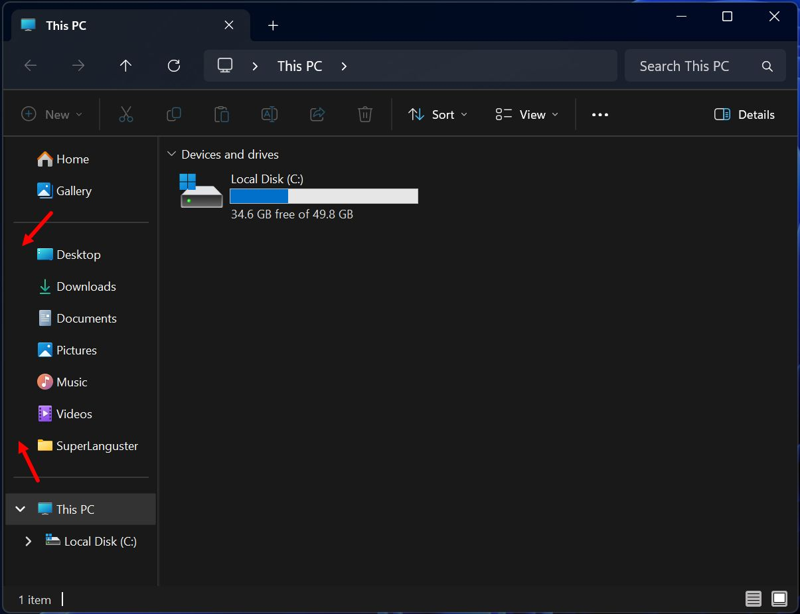
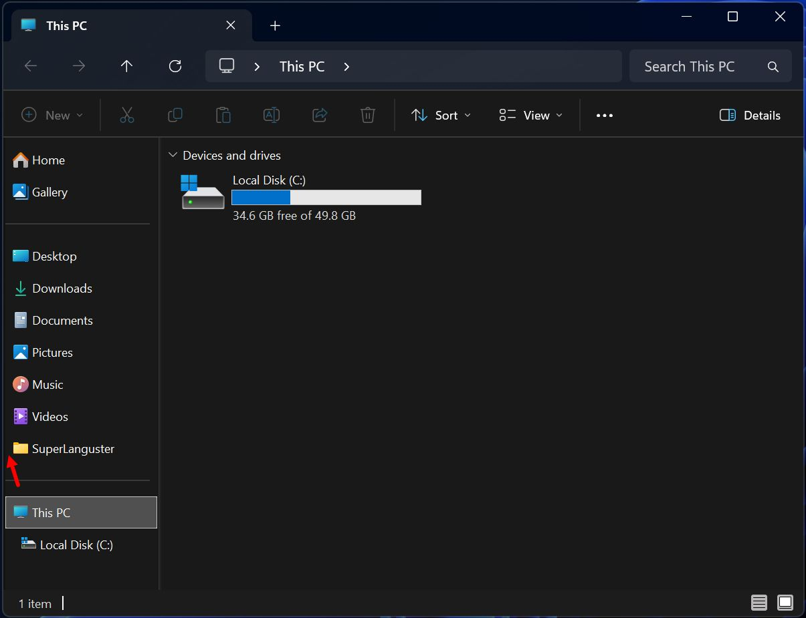

## Windhawk version

This project is also available as a Windhawk mod.

The original project name is `ExplorerNavHook`, while the Windhawk version is published under a more descriptive name: `Explorer Navigation Pane Tweaks`.

**Windhawk mod name:** `Explorer Navigation Pane Tweaks`  
**Windhawk mod id:** `explorer-navigation-pane-tweaks`

Source file:
`explorer-navigation-pane-tweaks.wh.cpp`

# ExplorerNavHook

Compact navigation pane hook for Windows Explorer.

ExplorerNavHook reduces the left indentation in the File Explorer navigation pane and makes the tree view more compact.

## Before / After

### Default Explorer


### With ExplorerNavHook


## What it does

- reduces left indentation in the navigation pane
- keeps the modern Explorer look
- supports config-based behavior through `ExplorerNavHook.ini`
- includes helper scripts for install and uninstall

## Files

- `ExplorerNavHook.exe` — loader
- `ExplorerNavHook.dll` — hook library
- `ExplorerNavHook.ini` — configuration file
- `register.cmd` — registration script
- `uninstall.cmd` — uninstall script

## Installation

1. Download the latest release.
2. Extract all files into one folder.
3. Run `register.cmd` if needed.
4. Run `ExplorerNavHook.exe`.
5. Open a new Explorer window.

## Configuration

ExplorerNavHook is configured through `ExplorerNavHook.ini`.

### Example config

```ini
[Hook]
TargetIndent=30
RemoveHasButtons=1
RemoveHasLines=1
RemoveLinesAtRoot=1
```

### Parameters

- `TargetIndent` controls how far the navigation tree is shifted to the left.
- `RemoveLinesAtRoot` controls whether the main expand/collapse arrow is shown for root items such as `This PC`, while keeping child arrows for child items in the tree.
- `RemoveHasButtons` removes all expand/collapse arrows in the tree.
- `RemoveHasLines` controls tree line visibility.

### Recommended settings

For most users, the recommended setup is:

```ini
[Hook]
TargetIndent=25
RemoveHasButtons=1
RemoveHasLines=1
RemoveLinesAtRoot=1
```

Recommended starting point:

- `TargetIndent=25`

Recommended adjustment range:

- `25` to `35`

Use higher or lower `TargetIndent` values depending on your display scaling, Explorer layout, and personal preference.

## Compatibility

- confirmed working on Windows 11
- confirmed working on Windows 10

## Notes

- Behavior may change after major Windows updates.
- Use at your own risk.

## License

MIT
